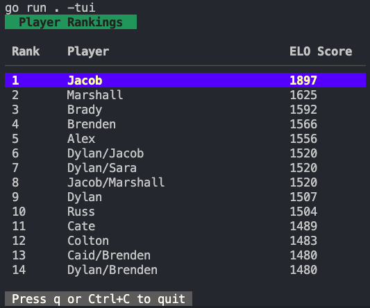

# guildmaster

```text
                     ▄▄    ▄▄         ▄▄                                                        
                     ██  ▀███       ▀███                                   ██                   
                           ██         ██                                   ██                   
 ▄█▀████████  ▀███ ▀███    ██    ▄█▀▀███ ▀████████▄█████▄  ▄█▀██▄  ▄██▀████████  ▄▄█▀██▀███▄███ 
▄██  ██   ██    ██   ██    ██  ▄██    ██   ██    ██    ██ ██   ██  ██   ▀▀ ██   ▄█▀   ██ ██▀ ▀▀ 
▀█████▀   ██    ██   ██    ██  ███    ██   ██    ██    ██  ▄█████  ▀█████▄ ██   ██▀▀▀▀▀▀ ██     
██        ██    ██   ██    ██  ▀██    ██   ██    ██    ██ ██   ██  █▄   ██ ██   ██▄    ▄ ██     
 ███████  ▀████▀███▄████▄▄████▄ ▀████▀███▄████  ████  ████▄████▀██▄██████▀ ▀████ ▀█████▀████▄   
█▀     ██                                                                                       
██████▀                                                                                         
```

## Overview

Guildmaster is a lightweight Go application that calculates and tracks player rankings using the Elo rating system. The tool reads game results (particularly Magic: The Gathering games) from CSV data and computes updated ratings using a pairwise Elo scoring method suitable for multiplayer ranked games.



## Features

- **Elo Rating Calculation**: Implements the Elo rating system to provide an objective measure of player skill
- **CSV Data Processing**: Reads game records from a CSV file to calculate ratings
- **Player Performance Tracking**: Maintains and updates player ratings based on game outcomes
- **Flexible Input**: Supports a variety of game formats where players are ranked from winner to losers
- **Terminal User Interface**: View rankings in an interactive TUI with navigation controls

## Scoring rules (multiplayer pairwise Elo)

Guildmaster scores multiplayer games by treating each finished game as a set of pairwise matches derived from the final ranking. For a game with N players, every higher-placed player is considered to have "won" against every lower-placed player in that same game. Examples:

- 1st place beats 2nd, 3rd, 4th, ...
- 2nd place loses to 1st but beats 3rd, 4th, ...
- 3rd place loses to 1st and 2nd but beats 4th, ...

All pairwise expected scores are computed using Elo with the configured D constant and K factor. By default Guildmaster uses:

- K = 40
- D = 800

Updates are calculated from a snapshot of player ratings before the game, accumulated as deltas for each player (summing every pairwise result), and applied once per player. This prevents order-dependent updates and ensures deterministic results when combined with the stable sorting tie-breaker (player name) used when presenting rankings.

This approach gives more consistent and interpretable rating changes for multiplayer events compared to only scoring adjacent placements.

## Requirements

- Go 1.25
- Dependencies:
  - github.com/kortemy/elo-go
  - Make

## Installation

```bash
# Clone the repository and navigate to that directory
git clone https://github.com/dylanlott/guildmaster.git
cd guildmaster

# Build the application locally 
make build

# Run the scoring algorith
make run

# Run the terminal application 
make tui
```

## Usage

1. Prepare your game data in a CSV file with the following format:
   - First column: Empty (or can contain identifier)
   - Second column: Date of the game
   - Subsequent columns: Players in order of finish (winner first)

2. Run the application:

```bash
# Using the default CSV file (mtgscores.csv)
./guildmaster

# Using a custom CSV file
./guildmaster -path=path/to/your/data.csv

# Display rankings with Terminal User Interface
./guildmaster -tui
```

### Terminal User Interface

The `-tui` flag enables an interactive Terminal User Interface for viewing player rankings:

- Navigate through the rankings using the **up** and **down** arrow keys
- Exit the TUI by pressing **q** or **Ctrl+C**

This provides a more interactive way to browse player rankings, especially when dealing with large player pools.

#### Example: TUI mode

Run the app in TUI mode:

```bash
go run . -tui
```

## Data Format Example

The expected CSV format looks like:

```csv
,2022-01-01,PlayerA,PlayerB,PlayerC
,2022-01-08,PlayerB,PlayerA,PlayerD
```

Where:

- The first column is empty
- The second column contains the date
- The remaining columns list players in finishing order (winner to losers)

## How It Works

The application:

1. Reads the game data from the specified CSV file
2. Initializes each player with a base Elo rating
3. For each game, updates player ratings based on their performance using pairwise outcomes
4. Calculates and displays the final Elo ratings for all players

## Contributing

Contributions are welcome! Please feel free to submit a Pull Request.

## License

This project is licensed under the MIT License - see the [LICENSE](LICENSE) file for details.
